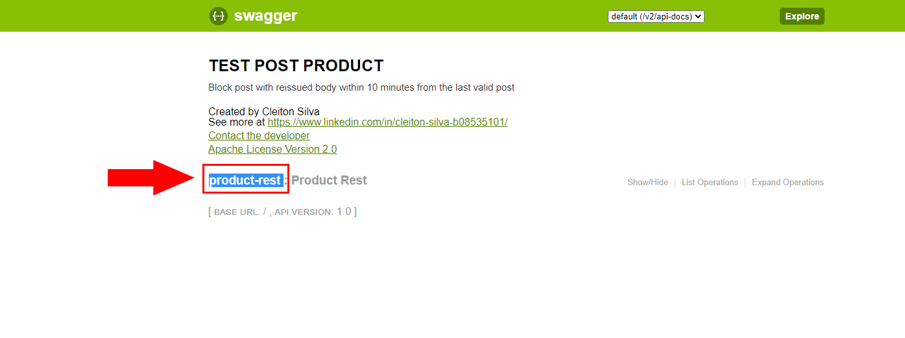
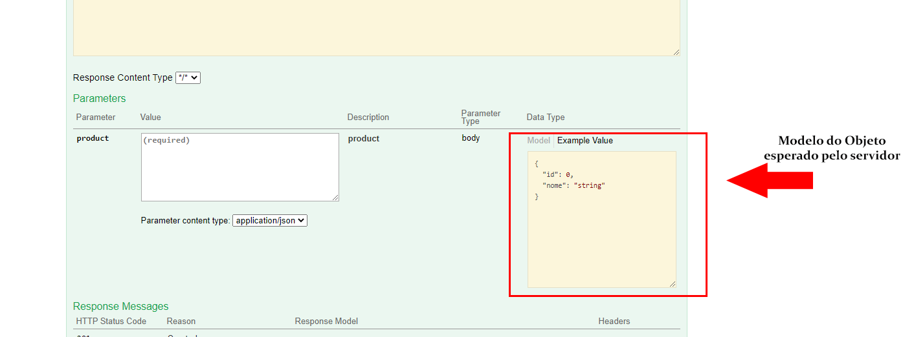
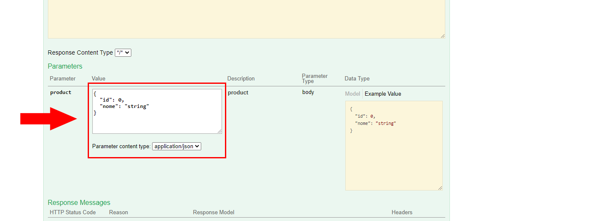
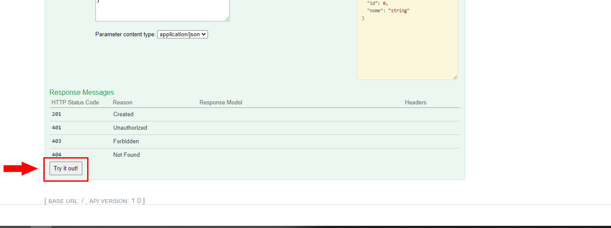
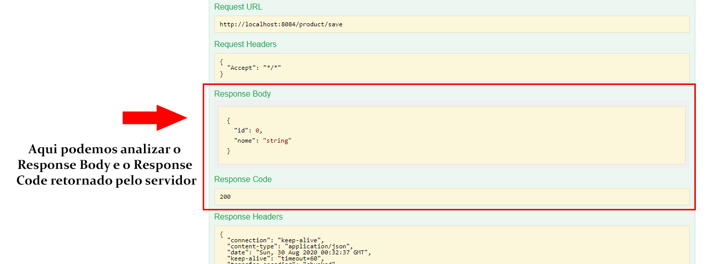

# Post Product
Implementação consiste e um endPoint que recebe requisições do tipo post e valida se o corpo da requisição foi o mesmo em um intervalo de 10 minutos
Abaixo imagem ilustrativa do ciclo de vida da requisição:

## Executando e testando o projeto

### Pré-requisitos
* Java 8
* Maven
### Passo a passo
## OBS: Em caso de a porta 8480 não estar disponível altere-a no "application.yml" no seguinte caminho:
`{diretório root}\src\main\resources\application.properties`

#### 1 - Testando a Aplicação
`Obs para rodar os testes lembre-se que o maven precisa estar instalado.`

Dentro do diretório root da aplicação executar os passos abaixo para rodar os tests automatizados.

`$ mvn test #Para rodar os testes`

verifique o resultado do teste no console.

#### 2 -  buildar :
`$ mvn clean install #buildando o pacote da aplicação`

#### 3 - executar a aplicação:

O Maven através do `spring-boot-maven-plugin` gerou o jar executável do projeto quando executamos o passo 2.
Então basta entrar no diretório `target/` que esta no diretório root e executar:

`$ java -jar api-0.1.jar`

A partir deste ponto se tudo ocorrer corretamente a aplicação estará rodando 
e atendendo requisições através da porta cadastrada no arquivo `application.yml` (se não foi alterado a porta 8084 será a porta do sistema).

É possível utilizar o client do swagger através da url [http://localhost:8084/swagger-ui.html]

### 4 Testando pelo Swagger

Na tela inicial do Swagger clicke no link `product-rest`.

Em seguida click no path `POST /product/save`.

Agora você pode clicar no exemplo do objeto que o servidor está esperando.

Se você desejar poderá alterar o objeto antes de realizar o post de requisição, para isso utilize o `text box Value `. 

Em fim para realizar a requisição para o servidor basta clicar em `"Try it out!"`.

Podemos ver o retorno do servidor em Response Body e Resonse Code.

Lembrando que neste teste é esperando o erro 403 em caso de requisições repetidas num intervalo de 10minutos.

