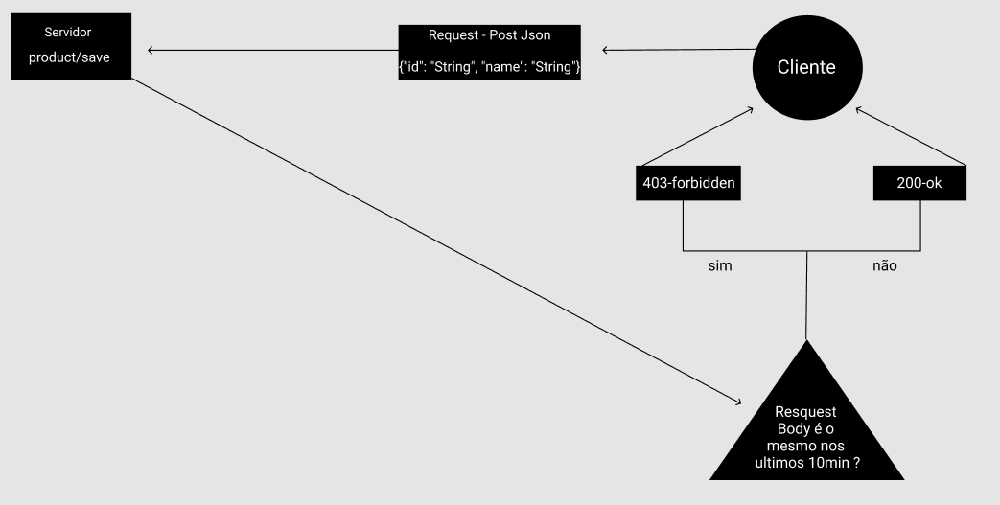

# Post Product
Implementação consiste e um endPoint que recebe requicições do tipo post e valida se o corpo da requicição foi o mesmo em um intervalo de 10 minutos
Abaixo imagem ilustrativa do ciclo de vida da requicição:

## Executando e testando o projeto

### Pré-requisitos
* Java 8
* Maven
### Passo a passo
## OBS: Em caso de a porta 8480 não estar dispónivel altere-a no "application.yml" no seguinte caminho:
`{diretório root}\src\main\resources\application.properties`

#### 1 - Testando a Aplicação
##Obs para rodar os testes lembre-se que o maven precisa estar instalado. 

Dentro do diretório root da aplicação executar os passos abaixo.

`$ mvn test #Para rodar os testes`

#### 2 -  buildar :
`$ mvn clean install #buildando o pacote da aplicação`

#### 3 - executar a aplicação:

O Maven através do `spring-boot-maven-plugin` gerou o jar executavel do projeto quando executamos o passo 2.
Então basta entrar no diretório `target/` que esta no diretorio root e executar:

`$ java -jar api-0.1.jar`

A partir deste ponto se tudo ocorrer corretamente a aplicação estará rodando 
e atendendo requisições através da porta cadastrada no arquivo `application.yml` (se não foi alterado a porta 8084 sera a porta do sistema).

É possível utilizar o client do swagger através da url [http://localhost:8084/swagger-ui.html]

#### 4 Criar o tunel para acessar os endpoints externamente

Utilizamos o `ngrok` para criar uma ponte para da nossa API externamente.

Faça o download do ngrok no seguinte link: https://ngrok.com/download 

Após o dowload execute o arquivo baixado e entre com  a seguinte linha de comando 

`$ ngrok http 8084` 

Retornarão as urls (http ou https) pelas quais se poderá acessar a aplicação externamente.

#### 5 Criar um repositório e cadastrar o webhook no github.

Cadastrar o endpoint /events como webhook e escolher a opção de escutar 
apenas os eventos de `issues`.

* Webhooks Overview: https://developer.github.com/webhooks/ 
* Creating Webhooks : https://developer.github.com/webhooks/creating/

#### 6 - Testar a aplicação
* Realizar as operações que deverão disparar eventos no repositório do Github ao qual foi cadastrado o webhook:
    1) criar nova issue
    2) Adicionar labels
    3) Adicionar Assigne
    4) Adicionar mais Assignees
    5) Criar Milestone
    6) fechar a issue.
    7) Atualizar o nome da issue.
    
* Acompanhar nos logs as chamadas realizadas.

* Utiliar um client ou Acessar a inteface web do swagger gerada pela aplicação para testar o endpoint `GET issues/{issueId}/events` 
para recuperar os eventos gravados.

**Observação:**

É possível acompanhar o `id`'s das `issues` através do payload das chamadas ao `/events` logadas, porém
a saída não está muito formatada. Alternativamente podemos buscar
os ids no banco.

É possível através da query abaixo obter estes id's.

`SELECT DISTINCT id FROM github_issue_snapshot`

## Endpoints 

`GET /issues/{issueId}/events`

`POST /events`

## Principais tecnologias e frameworks utilizados

- Java 8
- Spring Boot 2
- JUnit 5
- Mockito
- Hibernate
- Swagger
